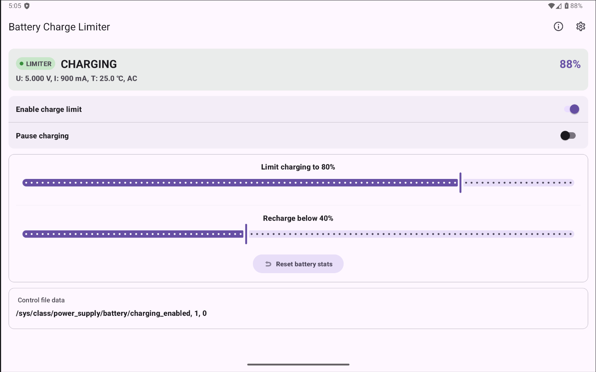
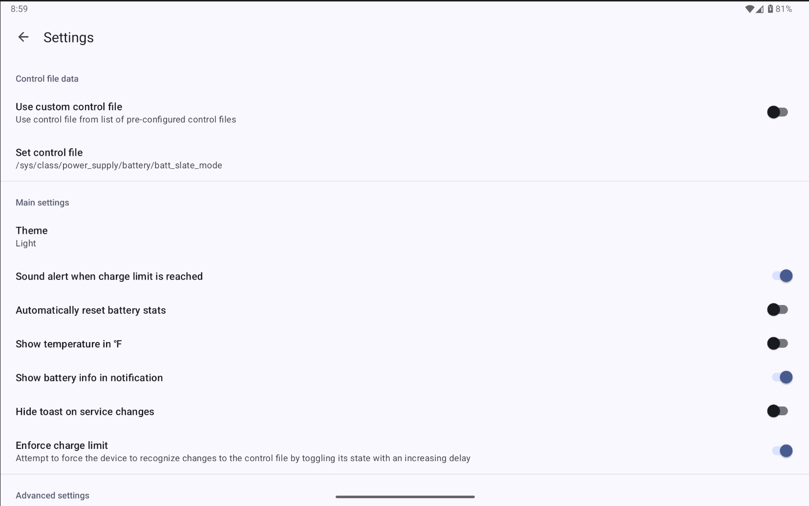
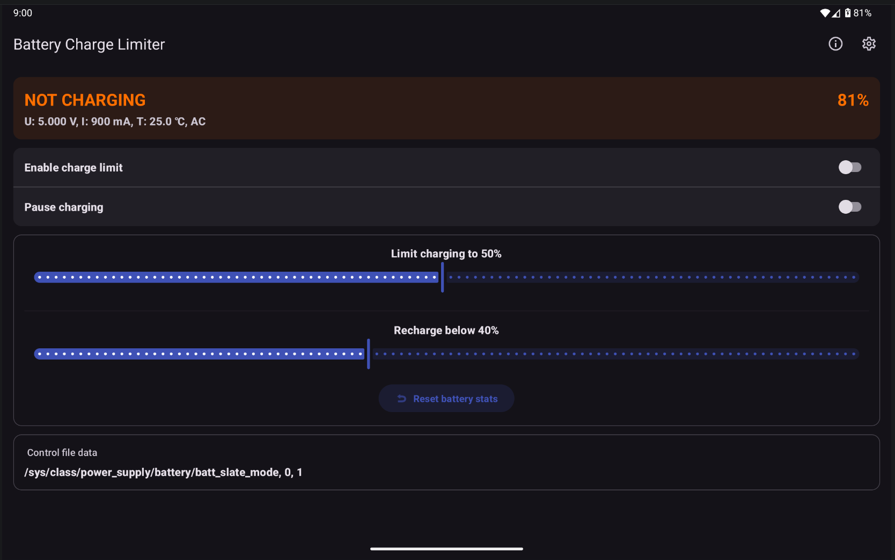

# Battery Charge Limiter (BCL)

A fork of **Battery Charge Limit** whose development has been stalled for some time.

**NOTE:** This is app currently requires root to function. It is not possible to control charging without root.

## Screenshots





## What's changed in release 1.4.1

### Features
- **Main UX**: Updated the main dashboard to clearly show when no control file is selected.
- **Main UX**: Added logic to prevent enabling the charge limit if no control file is currently selected.
- **Main UX**: Redesign main screen switch logic to enforce mutual exclusivity between manual override and auto-limit modes.
- **Main UX**: Add a visual "Limiter" badge on the main screen to show real-time service status (Active/Inactive).
- **Main UX**: Add "Experimental" and "Known Issues" badges to the control file view in main screen for better transparency on
- **Main UX**: Optimize Material 3 theme color resolution for the status card background.
- **Settings UX**: Refactored the "Control file data" section for better clarity. Replaced text "Configurable CTRL file data" with a "Use custom control file".
- **Settings UX**: The selected control file path or custom configuration is now displayed immediately upon selection.
- **Settings UX**: Added summaries for "Theme", "Control File", and "Configure Control Data" to improve UX.
- **Settings UX**: Consistent look & feel by applying sentence case style, i.e. only first word is uppercase.
- **Settings UX**: Add a "Stop and Continue" confirmation dialog when changing control file configuration while the service is active.
- **Notifications**: Modernized the notification channel for better compatibility with Android 13+.
- **Notifications**: Notification sounds are now restricted to three key events: reaching the upper charge limit, connecting power and disconnecting power.
- **Config**: Add control file siop_level to control_files (for Samsung)
- **Robustness**: Added logic to prevent enabling the charge limit if no control file is currently selected.
- **Localization**: Improved German language translations and localized new settings summaries.
- **Localization**: Implement localized battery status strings (uppercase) for the UI while maintaining English-only logging.

### Optimizations
- **Performance**: Improved `SharedPreferences` performance by batching writes into single `apply()` calls.
- **Performance**: Optimized startup by moving control file validation to a background thread to prevent UI hangs.
- **Service Persistence**: The background service now stays active even when the charger is unplugged. This ensures that the app is always ready to enforce limits the moment you plug it back in, without needing to manually restart the service.
- **Resource Optimization**: Optimized how the app listens for power events to reduce background system load and improve battery efficiency.
- **Improved Reliability**: Re-engineered the internal charging logic using a "state machine" to more accurately track and manage transitions between charging states, especially on devices with complex power drivers.

### Bug Fixes
- **Fix**: Resolved "pre-filled" default value in the custom control file configuration. User must select a control file or define a custom one.
- **Fix**: Synchronize ForegroundService state updates to prevent race conditions and duplicate "Stop" dialogs.

### Maintenance
- **Build**: Generated APKs follow new file naming convention: `battery-charge-limiter-<build-variant>.<version>.apk`
- **Documentation**: Added section in this README file that explains [Pulse Mechanism](#intelligent-charging-control-pulse-mechanism)


## What's changed in release 1.4.0
### Features
- **Main UX**: Added real-time battery level indicators on the main screen with state-aware coloring (Green for charging/full, Orange for discharging).
- **Main UX**: Now displays the specific power source (AC, USB, Wireless) in the battery info dashboard.
- **Main UX**: Updated default limits to 40% (Min) and 50% (Max) to maximize longevity for devices permanently connected to power.
- **Localization**: Improved clarity for notification settings and synchronized translations across all 12 supported languages.

### Optimizations
- **Performance**: Refactored battery info retrieval to be fully asynchronous, offloading blocking shell commands to a background executor to prevent UI stutters and ANRs.
- **Performance**: Refactored charger file control logic to avoid redundant writes and unnecessary mount operations, improving efficiency and error handling.
- **Performance**: Added a 1-second debounce to sliders to prevent UI lag and excessive disk writes during adjustment.
- **Optimization**: Now prioritizes direct `sysfs` paths for correct current (mA) reporting.

### Bug Fixes
- **Fix**: Fixed notification sound issues on Android 8.0+ by implementing direct playback for ongoing service notifications.
- **Fix**: Resolved the "Pulse to 1" bug by forcing the charger OFF when plugging in while already above the limit.

### Maintenance
- **Build**: Improved build stability with updated lint baselines and refined emulator detection logic.
- **Cleanup**: Removed unnecessary imports and obsolete notification sound management functions.
- **Testing**: Added comprehensive ADB commands and instructions for simulating battery events in emulators.


## What's changed in release 1.3.1

### Features
- **Main UX**: Renamed "Disable charge now" to "Pause charging" across all supported languages for better consistency.
- **About UX**: Added and synchronized translations for the "About" dialog
- **About UX**: Refreshed app authorship and credits to reflect 2026 and the new repository home.

### Bug Fixes 
**Fix**: Corrected the battery info format string across all languages to match the updated 3-parameter format used in the English version.


## What's changed in release 1.3.0

### Features
- **Main UX**: Refactored the dashboard with a cleaner look. Switches are now cards that change color (green/orange) to clearly show their state.
- **Main UX**: Both sliders now have a fixed 0-100% range for better stability—no more confusing jumps!
- **Main UX**: Added "push" logic so moving one slider automatically adjusts the other to maintain the "lower < upper" rule.
- **Main UX**: Renamed "Disable charge now" to "Pause charging" to be more intuitive.
- **Main UX**: battery info now shows also real-time current (mA)
- **Main UX**: Lowered the minimum stop limit to 1% and updated defaults to 70% (start) / 80% (stop).

### Bug Fixes
- **Fix**: Resolved stability issues when quickly adjusting sliders.

## What's changed in release 1.2.0

### Features
- **Main UX**: Fixed refreshing control file data on return to Main screen. This will now be in sync with what was selected in settings screen.
- **Main UX**: Removed all GUI elements and related code that allowed to stop charging based on voltage to make app interface cleaner and simpler to use.

### Maintenance
- **Build Migration**: Migrated build system to Kotlin DSL and Gradle 9.3.1.
- **SDK Update**: Updated to JVM SDK 17.


## Main Features of BCL
- Free and open source.
- Material 3 with dynamic colors.
- Control when to start and stop charging based on battery percentage — either directly or via a widget.
- Set custom battery control configuration if the supplied ones cannot be used properly.

## Intelligent Charging Control (Pulse Mechanism)
BCL uses an intelligent "Pulse" mechanism to manage the charging. 

### Why it's needed
On many devices, the battery driver might ignore a "charging OFF" command if it arrives immediately after a charger is plugged in or while the kernel is busy updating its own status. BCL solves this by using a cycling approach to ensure the hardware registers the change.

### How it works
When the battery reaches the limit but the system reports it is still charging, BCL performs the following steps:

1. **The Double-Tap (Pulse)**: Instead of just sending an **OFF** command (stop charging), the app briefly cycles the state to **ON** (start charging) and then schedules an **OFF** command after a short delay (`backOffTime`). This "edges" the hardware state to ensure the final stop command is accepted.
2. **Increasing Backoff**: If the hardware doesn't respond immediately, BCL doubles the delay for the next attempt (e.g., 500ms → 1000ms → 2000ms), up to a maximum of 30 seconds. This prevents unnecessary root command spam while ensuring eventual success.
3. **Safety Buffer**: If the battery is only 1% above the limit, BCL avoids pulsing and simply sends a silent "OFF" command. This prevents the "Pulse to 1" bug where the phone rapidly toggles charging on/off when it's exactly on the edge.
4. **Cool-down periods**: BCL ignores stale system broadcasts for a few seconds after a state change to prevent "race conditions" where old battery info interferes with a pulse currently in progress.

### Visual Timing Graph
This graph shows the charging state over time as the app attempts to force a stop. Each pulse represents a new attempt triggered by a system broadcast if the previous attempt failed.

**ON** and **OFF** are the commands that start respectively stop charging):
```text
    ^
on  |  _    __    ____      ________          ________________                  ______________________________
    | | |  |  |  |    |    |        |        |                |                |                              |
off | |_|__|__|__|____|____|________|________|________________|________________|______________________________|____
     1s   2s    4s        8s                16s                               30s (MAX)
```

### Timing Diagram (Pulse Sequence)
When the app detects that charging hasn't stopped, it performs a "Recovery Pulse":

|Sequence      | Time      | Action                     | Charger State | backOffTime|
|--------------|-----------|----------------------------|---------------|-------------|
|1. Broadcast  | t=0ms     | onReceive() triggered      | (STUCK ON)    | 500ms|
|2. Logic      | t=0ms     | backOffTime doubled        | ON            | 1000ms|
|3. Setup      | t=0ms     | Utils.changeState(ON)      | ON            | 1000ms|
|4. Schedule   | t=0ms     | Handler.postDelayed(OFF)   | ON            | 1000ms|
|5. Pulse Ends | t=1000ms  | Delayed Task executes      | OFF           | 1000ms|
|6. Verify     | t=next    | Next broadcast (Success?)  | OFF           | 500ms (Reset)|


**Explanation of the sequence:**
*   **Steps 1–4** happen immediately (within milliseconds) as soon as the app receives a battery update showing that the charge hasn't stopped.
*   **Step 2** doubles the timer *before* the pulse starts. This is because the app treats the pulse as a "Level 2" intervention—the "Level 1" intervention was the initial `OFF` command sent when you first hit the limit, which has already failed.
*   **Step 5** is the actual hardware change where charging is forced `OFF` again after the pulse duration.
*   **Step 6** happens when the Android system sends the next battery update. If charging has finally stopped, the `backOffTime` is reset to 500ms for the next time it's needed.


## Troubleshooting
If BCL cannot start or stop charging correctly, enable **Always Write CTRL File** in the settings.

## License

GNU General Public License v3.0
